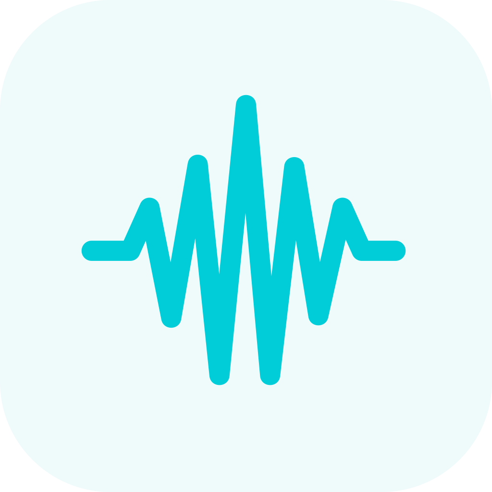

# DrummFix



DrummFix исправляет закрытый хай-хэт **Alesis Turbo Mesh** при игре в **GarageBand** на Mac. Если при нажатой педали удар по хай-хэту звучит открытым, приложение считывает состояние педали из MIDI-сигнала и передаёт в GarageBand правильную ноту закрытого хай-хэта. Остальные пэды и отдельный звук закрытия педали проходят без изменений.

Приложение работает локально. Учётная запись и доступ к сети не нужны.

## Скачать и установить

**[Скачать DrummFix 0.2.1 для Mac с Apple Silicon (.dmg)](https://github.com/nowmdr/drummfix/releases/download/v0.2.1-beta.1/DrummFix-0.2.1-macOS-arm64.dmg)** · [Все выпуски](https://github.com/nowmdr/drummfix/releases)

Откройте `.dmg` и перетащите `DrummFix.app` в `Applications` («Программы»). Это предварительная сборка: она подписана локально, **пока не подписана Developer ID и не нотарифицирована Apple**. При первом запуске macOS может заблокировать её. Если вы доверяете скачанному файлу, попробуйте открыть приложение, затем в **Системные настройки → Конфиденциальность и безопасность** выберите **Открыть всё равно**. [Инструкция Apple](https://support.apple.com/guide/mac-help/open-a-mac-app-from-an-unknown-developer-mh40616/mac). Мы не просим отключать Gatekeeper.

Из терминала тот же файл можно получить через GitHub CLI:

```sh
gh release download v0.2.1-beta.1 -R nowmdr/drummfix -p '*.dmg'
```

Альтернативный способ — [собрать приложение из исходников](#сборка-из-исходников). Homebrew-пакета сейчас нет.

## Начать играть

1. Подключите Alesis Turbo Mesh к Mac по USB и включите модуль.
2. Сохраните проект GarageBand и полностью закройте GarageBand через `⌘Q`.
3. Запустите DrummFix, выберите **Alesis Turbo** и нажмите **«Включить исправление»**.
4. Нажмите **«Открыть GarageBand»**. Выберите дорожку Software Instrument → Drum Kit и нужный набор.
5. Держите DrummFix открытым во время игры и записи.

Проверьте три состояния: отпущенная педаль + удар — открытый хай-хэт; зажатая педаль + удар — закрытый; нажатие педали без удара — обычный звук педали. Для закрытых ударов можно выбрать режим динамики «Исходная», «Умеренная» или «Сильная».

Полная инструкция, диагностика, действия после отключения USB и восстановление обычного MIDI-входа — в [руководстве](docs/USER_GUIDE.md).

## Совместимость

- Проверено: Alesis Turbo Mesh по USB, MacBook Pro M1 Pro, macOS 26.6.2, GarageBand 10.4.14.
- Сборка предназначена для **Apple Silicon (arm64)**. Минимальная версия в пакете — macOS 14; на macOS 14 и Intel приложение пока не проверялось.
- Другие модели барабанов и приложения не тестировались.

DrummFix — независимая утилита. Она не связана с Alesis или Apple.

## Сборка из исходников

Нужны macOS 14+, Apple Command Line Tools и Swift 6. Полный Xcode не обязателен.

```sh
git clone https://github.com/nowmdr/drummfix.git
cd drummfix
zsh scripts/build-app.sh
```

Готовое приложение: `dist/DrummFix.app`. Его можно перенести в `Applications`. Для создания `.dmg`:

```sh
zsh scripts/package-dmg.sh
```

Проверки преобразования MIDI:

```sh
swift build
.build/debug/DrummFixTests
.build/debug/DrummFixProbe --test-loopback
```

## Помощь

Если что-то не работает, откройте [GitHub Issue](https://github.com/nowmdr/drummfix/issues), указав модель барабанов, версии macOS/GarageBand, действия для повторения ошибки и ожидаемый/фактический результат. Перед публикацией журнала из DrummFix просмотрите его содержимое.

Проверки текущей версии описаны в [документе](docs/VERIFICATION.md). Приложение не отправляет MIDI-события и журнал в интернет.

## Лицензия

Исходный код распространяется по [MIT License](LICENSE). DrummFix — независимый проект.
